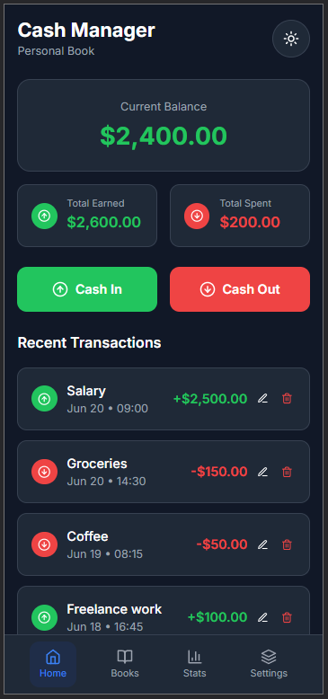

# 💰 Cash Manager

> *A simple, client-side web application for managing your personal finances.*

 

---

## 🌐 Overview

🧾 **What is it?**  
A sleek, responsive **personal finance tracker** that runs entirely in your browser.  
No account needed. No data leaves your device. ✅  

> 🔐 All data is stored in **local storage** → privacy first!

---

## 🧠 Mind Map Summary 🗺️

### 🎯 [ Main Features ]
- 🏠 **Dashboard Overview**
  - 💵 *Current Balance*
  - 📈 *Total Earned*
  - 📉 *Total Spent*

- 🔁 **Transaction Management**
  - ➕ *Add income or expense*
  - ✏️ *Edit transactions*
  - 🗑️ *Delete with confirmation*

- 📚 **Multiple Books**
  - ➕ *Create new book*
  - 🔄 *Switch between books*
  - ✏️ *Edit*
  - 🗑️ *Delete*

- 🌗 **Dark & Light Mode**
  - 🌞 / 🌙 *Toggle with one click*

- 💾 **Persistent Storage**
  - 💡 *Saved in local browser storage*

---

## 🧰 Features & How to Use

### 🏠 **Dashboard Overview**  
> **💬 View your finances at a glance**

- 🧮 `Current Balance`  
- 💰 `Total Earned`  
- 💸 `Total Spent`  

---

### 🔁 **Transaction Management**  
> **📌 Keep track of every penny**

#### ➕ *To Add a Transaction*  
1. Click ✅ "Cash In" (green) or ❌ "Cash Out" (red)  
2. Fill in:
   - Amount 💰  
   - Description 📝  
   - Date 📆  
   - Time ⏰  
3. Click *Save*

#### ✏️ *To Edit or Delete*  
- Find in 🧾 `Recent Transactions`
- Click ✏️ to edit or 🗑️ to delete
- Confirm before deletion ✅

---

### 📚 **Multiple Books**  
> **📖 Organize income/expenses by category**

#### 📘 *Create Book*  
- Go to `Books` tab → click ➕ (top right)  
- Enter:
  - Name 🏷️  
  - Color 🎨  
- Click "Create Book"

#### 🔄 *Switch Between Books*  
- Navigate to `Books`
- Click "Switch" on desired book

#### ✏️ *Edit / Delete*  
- Click ⋮ on book → select Edit/Delete  
- Deleting removes all its data ⚠️

---

### 🌗 **Dark / Light Mode**  
> 🌓 Choose the look that suits your eyes

- Tap 🌞 or 🌙 icon (top right) to toggle themes

---

### 💾 **Persistent Local Storage**  
> 🔐 Your data stays **only** in your browser

- ✅ No sign up  
- ✅ Auto-saved  
- ✅ Fully offline

---

## 📁 Project Details

- 🖥️ **Built With:** HTML, CSS, JS
- 🧠 **Focus:** Simplicity, Privacy, UX
- 💼 **Use Case:** Students, Freelancers, Budgeters

---

## 📸 Screenshot

> *(Add a screenshot here)*  

---

## 🚀 Get Started

Simply open the project in your browser — no installation needed.  
All data is stored automatically and locally.

---

## 📜 License

MIT License  
Free to use and modify ✌️

---

## ✨ Contribute / Feedback

Got suggestions or want to contribute?  
[Open an Issue](#) or submit a Pull Request!

